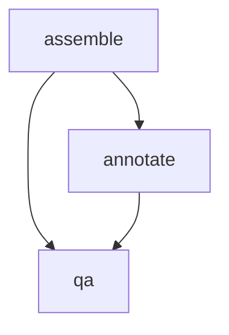

[](http://bioconda.github.io/recipes/mogaaap/README.html)
[](https://anaconda.org/bioconda/mogaaap)
[](https://anaconda.org/bioconda/mogaaap)

# MoGAAAP (Modular Genome Assembly, Annotation and Assessment Pipeline)
This repository contains a Snakemake pipeline for the assembly, annotation and quality assessment of HiFi-based assemblies.
Although developed for a project in lettuce, the pipeline is designed to work with any eukaryotic organism.
The pipeline will work with HiFi, ONT data and Hi-C, although only HiFi (or ONT) is required.

Additionally, MoGAAAP is set up in a modular way, allowing for any combination of assembly, annotation and quality assessment steps.
Therefore, MoGAAAP can **also** be used to e.g. only assess the quality of already assembled genomes, or only to annotate an unannoated genome assembly.

A test dataset is provided in the `test_data/` directory, including instructions.


## Index
- [Setup](#setup)
- [Initialise the pipeline](#initialise-the-pipeline)
- [Configure the pipeline](#configure-the-pipeline)
- [Run the pipeline](#run-the-pipeline)
- [Output](#output)
- [Explaining the pipeline](#explaining-the-pipeline)
- [Citation](#citation)
- [FAQ](#faq)


## Setup
To install MoGAAAP, you'll need a Linux machine with `conda` installed.

### Conda
If not installed already, `conda` can be installed by following these instructions:
```bash
# install miniforge
curl -L -O "https://github.com/conda-forge/miniforge/releases/latest/download/Miniforge3-$(uname)-$(uname -m).sh"
bash Miniforge3-$(uname)-$(uname -m).sh
# follow instructions and let it run `conda init`

# set default channels
source ~/.bashrc
conda config --set auto_activate_base false
source ~/.bashrc
conda config --add channels bioconda
conda config --add channels conda-forge
conda config --set channel_priority strict
```

### Install MoGAAAP
MoGAAAP can be installed using bioconda as follows:
```bash
conda create -c conda-forge -c bioconda -n mogaaap mogaaap
```

<details>
<summary>Click here for manual installation</summary>

If you prefer to install MoGAAAP manually, you can do so by following these instructions:
```bash
conda create -c conda-forge -c bioconda -n mogaaap snakemake=8 apptainer=1.3 poetry
conda activate mogaaap
```

Now that the dependencies are installed, the pipeline can be installed via:
```bash
git clone https://github.com/dirkjanvw/MoGAAAP.git
cd MoGAAAP/
poetry install
```
</details>

Then make sure to activate the environment before running the pipeline:
```bash
conda activate mogaaap
```

To check if MoGAAAP is installed correctly, run:
```bash
MoGAAAP --help
```

> [!NOTE]
> MoGAAAP uses apptainer for handling some software dependencies.
> Although apptainer has been installed as part of the conda environment, there are some environment variables that need to be set for it to work correctly.
> This has to be set in your `.bashrc` (don't forget to source the file after changing):
> - `APPTAINER_BIND`: To bind the paths inside the container to the paths on your system; make sure all relevant paths are included: **all** locations containing input and output of MoGAAAP need to be included here, as well as the location of the GXDB database.
>
> Optionally, you can also set these:
> - `APPTAINER_NV`: To use the GPU inside the container; only required if you have a GPU.
> - `APPTAINER_CACHEDIR`: To store the cache of the container outside of your home directory.
>
> More information can be found [here](https://apptainer.org/docs/user/main/appendix.html).

### Download databases
Next, download the databases that are required for the pipeline to run.
Please be aware that these databases are large and require a lot of storage space, but can be shared between different runs of the pipeline.
At the time of writing (February 2025), the total size of the databases is around 900GB.

| Database            | Download instructions                                                                                                                                                                    |
|---------------------|------------------------------------------------------------------------------------------------------------------------------------------------------------------------------------------|
| GXDB database       | Follow "Download the database" instructions on [FCS GitHub wiki](https://github.com/ncbi/fcs/wiki/FCS-GX-quickstart#download-the-fcs-gx-database) (I only tested the Cloud instructions) |
| Kraken2 nt database | Download `core_nt` from [this list](https://benlangmead.github.io/aws-indexes/k2)                                                                                                        |
| OMA database        | Download `LUCA.h5` from [this list](https://omabrowser.org/oma/current/)                                                                                                                 |

Importantly, the location of the GXDB database has be included in the `APPTAINER_BIND` environment variable (see note above).

A helper script is provided to automate the download of the databases.
As the hyperlinks of the databases are hardcoded in the script, please leave an issue on the GitHub page if any of the locations no longer works.
```bash
MoGAAAP download_databases -d databases/ all
```


## Initialise the pipeline
Before running the pipeline, the pipeline has to be initialised.
This will create a working directory for MoGAAAP to run in.
```bash
MoGAAAP init -d working_directory
```

In the rest of this README, we will use `working_directory` as the working directory.


## Configure the pipeline

### Sample sheet
Before configuring the pipeline, a sample sheet (in TSV format) has to be created.
In this TSV file, each row represents a sample.
An example of this file can be found in `working_directory/config/example.tsv` (and more examples are available in `working_directory/config/examples/`) but it is recommendable to create a new TSV file with the same header.
The sample TSV sheet has the following columns to fill in (one row per sample):

| Column name          | Required? | Description                                                                                                                                                              |
|----------------------|-----------|--------------------------------------------------------------------------------------------------------------------------------------------------------------------------|
| `accessionId`        | Required  | The accession ID of the sample. This name has to be unique.                                                                                                              |
| `assemblyLocation`   | `*`       | The path to a scaffolded assembly in FASTA format. Pipeline will skip assembly if this is provided. This is especially useful for performing QA on existing assemblies.  |
| `annotationLocation` | Optional  | The path to an annotation in GFF3 format. Only allowed if `assemblyLocation` is provided. Pipeline will skip annotation if this is provided.                             |
| `hifi`               | `*`       | The path to the HiFi reads in FASTQ or FASTA format. Multiple libraries can be provided by separating them with a semicolon.                                             |
| `ont`                | `*`       | The path to the ONT reads in FASTQ or FASTA format. Multiple libraries can be provided by separating them with a semicolon.                                              |
| `illumina_1`         | Optional  | The path to the forward Illumina reads in FASTQ format.                                                                                                                  |
| `illumina_2`         | Optional  | The path to the reverse Illumina reads in FASTQ format.                                                                                                                  |
| `hic_1`              | Optional  | The path to the forward Hi-C reads in FASTQ format.                                                                                                                      |
| `hic_2`              | Optional  | The path to the reverse Hi-C reads in FASTQ format.                                                                                                                      |
| `haplotypes`         | Required  | The expected number of haplotypes in the assembly. Use 1 for (near) homozygous accessions and 2 for heterozygous accessions. **NB**: currently only 1 or 2 is supported. |
| `speciesName`        | Required  | A name for the species that is used by Helixer to name novel genes.                                                                                                      |
| `taxId`              | Required  | The NCBI taxonomy ID of the species.                                                                                                                                     |
| `referenceId`        | Required  | A unique identifier for the reference genome for which genome (FASTA), annotation (GFF3) and chromosome names are provided in the `config/config.yaml` file.             |

`*`: At least one of these fields is required.

**NB**: If the `assemblyLocation` is provided, no assembly will be performed and the provided assembly will be assumed to be a scaffolded assembly.
Therefore, `hifi` and `illumina_1`/`illumina_2` will only be used for the quality assessment module, and `ont` and `hic_1`/`hic_2` are not allowed.

### Configuration YAML
We can now create the configuration YAML file for MoGAAAP.
An example of this file is provided in `working_directory/config/example.yaml` and also see `working_directory/config/examples/` for more examples of filled-in configuration files.
There are two ways of generating a configuration YAML file:
1. Copy the example file and fill in the fields.
2. Run the following command to generate a configuration YAML file:
```bash
MoGAAAP configure  # see --help for all options that are required
```

While the command can be a great help, it is recommended to always double-check the generated configuration YAML file and compare it to the example file.


## Run the pipeline

### Available modules
Several modules are available in this pipeline (will be referred to later as `${MODULE}`):
- `assemble`: This module will assemble the reads into contigs and subsequently scaffold the contigs using `ntJoin` against a provided reference genome.
  - `contig`: This is the first step of the `assemble` module and will only assemble the reads into contigs. Only use this if you want to inspect the contig assembly before scaffolding.
- `annotate`: This module will generate a provisional annotation of the assembly using `liftoff` and `helixer`, and optionally analyse user-defined queries.
  - `annotate_genes`: This only performs the gene annotation step of the `annotate` module without performing custom analysis.
  - `annotate_custom`: This only performs the custom analysis step of the `annotate` module without performing gene annotation.
- `qa`: This module will perform quality assessment of the scaffolded assembly and the provisional annotation.
- `all`: This module will run all the above modules (DEFAULT).

It is advisable to run the pipeline module by module for a new set of assemblies and critically look at the results of each module before continuing.
All modules except for `annotate` have visual output that can be inspected in an HTML report file (see at [Reporting](#reporting)).
For more information about these modules, see [Explaining the pipeline](#explaining-the-pipeline).

### Running the pipeline
Before running the pipeline, it is good practice to do a dry-run to check if everything is set up correctly:
```bash
MoGAAAP run -d working_directory ${MODULE} -n
```

If no errors are shown, MoGAAAP can be run using the following command:
```bash
MoGAAAP run -d working_directory ${MODULE}
```

It is generally recommendable to set the `--cores` and `--memory` flags to what is available on your system.
It is important to realise that Snakemake cannot enforce these limits, so it is up to the user to make sure that the limits are not exceeded.
In general, the number of cores will generally not exceed the limit, but for memory it is advisable to set the limit to a value that is lower than the available memory on your system (about half).
Please also check out the other options available by running `MoGAAAP run --help`.

> [!NOTE]
> Please note that the pipeline can also be run manually by running the Snakemake command directly within the working directory.
> If you're familiar with the Snakemake CLI, this is a good way to use MoGAAAP after the initial setup.
> A good starting point is to run `snakemake -n` to see what the pipeline would do without actually running it.


## Output
Next to the [report](#reporting) generated by Snakemake, the most important outputs of the pipeline are the genome assembly and annotation.
These can be found in the directory `working_directory/final_output`.
(All temporary files are stored in the `working_directory/results` directory.)

The `working_directory/final_output` directory contains the following files:

| File name                        | Description                                                                                                                   |
|----------------------------------|-------------------------------------------------------------------------------------------------------------------------------|
| `${accessionId}.contigs.fa`      | The contigs produced by the `assemble` module.                                                                                |
| `${accessionId}.full.fa`         | The scaffolded assembly produced by the `assemble` module.                                                                    |
| `${accessionId}.nuclear.fa`      | The scaffolded assembly produced by the `assemble` module, but only nuclear contigs as obtained from the `annotate` module.    |
| `${accessionId}.${organelle}.fa` | The scaffolded assembly produced by the `assemble` module, but only organellar contigs as obtained from the `annotate` module. |
| `${accessionId}.full.gff`        | The provisional annotation produced by the `annotate` module; belongs to `${accessionId}.full.fa`.                            |
| `${accessionId}.full.coding.gff` | The provisional annotation produced by the `annotate` module, but only coding genes; belongs to `${accessionId}.full.fa`.     |


## Explaining the pipeline
Assembling a genome from raw data to a final usable resource is a process that is hard to automate.
We believe that this process always necessesitates human curation.
However, large parts can easily be automated, which is why we created this pipeline.
This pipeline performs the assembly, scaffolding and renaming of genomic data as well as an initial provisional structural annotation.
Importantly, both genome assembly and annotation are subjected to quality assessment, providing a direct starting point for the curation of the assembly.
Furthermore, each part of the process (module) can be run separately after which its output can be inspected before continuing to the next step.



### Assemble module

#### Contigging
In the assemble module, HiFi reads are assembled using `hifiasm`.
If ONT reads are given, these are used in the assembly process using the `--ul` parameter of `hifiasm`.
Also, if Hi-C reads are given, these are used in the assembly process.
Since the output of `hifiasm` is a GFA file, we next convert the (consensus) primary contigs GFA to a FASTA file.
In case the user has indicated that the accession is heterozygous, the two haplotype assemblies as outputted by `hifiasm` are converted to FASTA files instead.
Finally, we produce an alignment of the (contig) assembly against the provided reference genome using `nucmer`.
To prevent spurious alignments, we slightly increased the `-l` and `-g` parameter of `nucmer`.

As alternative to `hifiasm`, we also implemented `verkko` as it is known to work well with HiFi (and ONT and Hi-C) data.
For heterozygous accessions, `hapdup` is used to try separating the haplotypes based on HiFi alignment to the Verkko assembly.
Please bear in mind that the pipeline was developed with `hifiasm` in mind, so although these other assemblers will technically work, the pipeline may not be optimally set up for them.
In some preliminary tests, we found that `verkko` doesn't work well with heterozygous accessions, resulting in a partly phased assembly.

#### Next steps
Since the next step after assembly is the scaffolding process, there has to be collinearity between the assembly and the reference genome.
This can be checked in the dotplot created from the `nucmer` alignment.
If there is no sign of collinearity between the two, reference-guided scaffolding will be hard/impossible.
The only solution in that case would be to choose another (more closely related) reference genome.

#### Scaffolding
Scaffolding is performed using `ntJoin`, which uses a minimizer-based reference-guided scaffolding method.
If by visual inspection collinearity between the assembly and reference genome was found, the scaffolding module generally runs without issues.
Should any error occur, please read the corresponding log file of the step that produced the error.
In most cases, the error may be resolved by choosing different values for the `ntjoin_k` and `ntjoin_w` in the configuration YAML file.
In our experience, increasing the value for `ntjoin_w` resolves most issues when no correct scaffolding is produced.
Alternatively, scaffolding can be done using `ragtag` by changing the `scaffolder` parameter in the configuration YAML file.

Importantly, Hi-C reads can be used for scaffolding too by setting the `YAHS` parameter in the configuration to `True`: this will run YAHS prior to scaffolding by `ntJoin`/`ragtag`.
It's important to stress that the default here is `False` because we have not tested `yahs` extensively, but preliminary tests show more accurate scaffolding.
Please open an issue on this GitHub page if you tested `yahs` and encountered problems.

After scaffolding, the sequences in the scaffolded assembly are renamed to reflect their actual chromosome names according to the reference genome.
Finally, `nucmer` is run again to produce an alignment plot for visual inspection of the scaffolding process.
If Hi-C reads were provided, the Hi-C contact map is also produced for visual inspection of the `ntJoin` scaffolding process.

#### Next steps
As the assembly as outputted by this module is used as starting point for the annotate and qa modules, it is crucial it matches the expectations in terms of size and chromosome number.
Please carefully look at the `nucmer` alignment plot to check that the assembly looks as expected before continuing to a next module.

### Annotate module

#### Gene annotation
Proper evidence-based structural gene annotation would take too long and is a problem that is not solved for fast automation yet.
Therefore, we implemented a "quick-and-dirty" provisional annotation in this pipeline by combing the results of `liftoff` and `helixer`.
`helixer` will run on the GPU if it's available, otherwise it will run on CPU (which is known to be a lot slower).
In case of overlap in features between `liftoff` and `helixer`, we take the `liftoff` annotation.

#### Next steps
Although this module generally runs for the longest time, no visual output is produced; only GFF3 file (one unfiltered and one with only coding genes) belonging to the scaffolded assembly.
This GFF3 file, together with the FASTA file from the scaffold module are the only inputs for the final module: QA.

#### Custom annotation
The purpose of the analyse module is to create a genome-wide overview of the newly created assembly.
It does this by running several user-defined queries (including organelle search) against the assembly using BLAST as well as a search for the telomere repeat sequence (please see [this note in the FAQ](#q-should-i-use-blastn-or-seqtk-for-the-telomere-search) for more information on telomere identification).
The results of these queries are visualised in an HTML report file.
Next to this, the user-defined queries are used to create a template `circos` configuration and plot.

#### Next steps
Typically, user-defined queries are used to either identify unwanted sequences (known contaminants or organelles) or to identify sequences that are expected to be present in the assembly (e.g. resistance genes).
The resulting tables in the report may be used to filter out unwanted sequences from the assembly, and to check the quality of the assembly based on the expected sequences (such as making sure the telomere repeat sequence is present at the tails of the chromosomes).

Circos plots are notoriously hard to automate and that is no different for this pipeline.
Although a `circos` plot should always be produced, it typically doesn't look quite right yet.
Feel free to copy the config files produced by this pipeline and adjust to your own plotting needs.

### QA module

#### Overview
This final quality assessment module is the most important for human curation of the genome.
The quality assessment steps in this module can be roughly divided into two categories: individual and grouped.
Individual quality assessment steps include k-mer completeness (`merqury`), k-mer contamination (`kraken2`), NCBI contamination (`fcs-gx`), adapter contamination (`fcs-adaptor`) and read mapping (`bwa-mem2`).
Grouped quality assessment steps include BUSCO completeness (`busco`), OMA completeness (`omark`), mash distances (`mash`), minimizer collinearity (`ntsynt`), k-mer phylogeny (`SANS`), k-mer pangenome growth (`pangrowth`), gene pangenome growth (`pantools`) and general statistics.
These groups are meant to give a comparative overview of the assembly and annotation.
Any groups can be defined in the configuration YAML file and a genome may occur in multiple groups.

#### Next steps
The report (see [Reporting](#reporting)) produced by this module is the most useful output of the pipeline for human curation.
It contains visual output for each of the quality assessment steps performed in this module including a description on how to interpret the results.
It also calculates various statistics that are reported on in the report.
Importantly, the qa module does not do any filtering of the assembly or annotation, only reporting.
Next steps could include (but are not limited to) removal of contaminants, discovery of sample swaps, cleaning the input data, etc.

## Citation
If you use MoGAAAP in your work, please cite this work as:
```bibtex
@misc{workum_mogaaap_2025,
	title = {{MoGAAAP}: {A} modular {Snakemake} workflow for automated genome assembly and annotation with quality assessment},
	author = {Workum, Dirk-Jan M. van and Dey, Kuntal K. and Kozik, Alexander and Lavelle, Dean and Ridder, Dick de and Schranz, M. Eric and Michelmore, Richard W. and Smit, Sandra},
	doi = {10.1101/2025.08.26.672321},
	publisher = {bioRxiv},
	month = aug,
	year = {2025},
}

```


## FAQ

### Q: Where can I see what my pipeline is doing?
A: The pipeline will print the commands it is running to the terminal.
Alternatively, you could look at `htop` or `top` to see what processes are running.

### Q: Pipeline crashes at renaming the chromosomes
A: This issue typically arises when the assembly and reference genome are not collinear because of an evolutionary distance that is too large.
In this case, the pipeline is not able to accurately discern which reference chromosome corresponds to which assembly scaffold.
This lack of collinearity should also be visible in the contig MUMmerplots created by the `assemble` module.
The only solution within MoGAAAP in this case would be to choose another (more closely related) reference genome and re-run the `assemble` module; or use `ragtag` as scaffolder instead of `ntJoin`.

### Q: Pipeline creates scaffolds that are obviously wrong
A: This issue can have multiple causes, but the most common one is that the `ntJoin` parameters are not set correctly.
From our own experience, increasing the value for `ntjoin_w` resolves most issues when no correct scaffolding is produced.
Alternatively, scaffolding can be done using `ragtag` by changing the `scaffolder` parameter in the configuration YAML file.
Also, it is important to keep in mind that this pipeline is not meant to create a perfect assembly, but to provide a starting point for human curation.
So feel free to adjust the pipeline or the assembly to your own needs!

### Q: Pipeline keeps crashing at kraken2
A: This is likely due to not enough available memory.
Kraken2 is a memory-heavy process that needs to fit its entire database in memory.
This requires up to 500 GB of RAM that has to be available to the process.

### Q: Pipeline crashes mid-run
A: This is intended Snakemake behaviour: if any job fails, the pipeline will only finish current running jobs and then exit.
As for the reason of stopping, please check the log file of the job that failed.
The name of the log file will be printed in the terminal output of the pipeline.
If the error is not clear, please open an issue on this GitHub page.

### Q: The pipeline cannot find software X
A: This would indicate an error on our side of determining the correct dependencies for the pipeline.
If the error persists, please report it as an issue on this GitHub page.

### Q: A job that uses singularity fails for no apparent reason
A: This is likely due to missing environment variables for Singularity/Apptainer.
See the note under [Install MoGAAAP](#install-mogaaap) for more information on how to set these environment variables.

### Q: Report HTML cuts off the top of the page
A: This is a known issue of the Snakemake report HTML that should only happen when running MoGAAAP manually with `snakemake`.
The wrapper `MoGAAAP` command should not have this issue.
The current workaround is to run:
```bash
sed -E 's/([^l]) h-screen/\1/g' report.html > report_fixed.html
```

### Q: My chromosomes are not named correctly
A: Please double check the names of the chromosomes in the reference genome you provided and the names of the chromosomes in the configuration YAML file.
We use strict matching to rename the chromosomes, so the names have to be exactly the same.

### Q: Should I use BLASTN or seqtk for the telomere search?
A: While `seqtk` is more accurate in the boundaries of the telomere search, it cannot identify telomeres that are not at the ends of the chromosomes.
Therefore, we recommend to *also* run BLASTN with a fasta file containing 100x the telomere repeat sequence for identification of telomeres that are not at the ends of the chromosomes.

### Q: I only have ONT data and no HiFi data; can I still use this pipeline?
A: MoGAAAP only supports ONT-only assemblies when using `hifiasm` as assembler.
However, we have not tested this functionality extensively, so please open an issue on this GitHub page if you run into any problems.

### Contact
If the above information does not answer your question or solve your issue, feel free to open an issue on this GitHub page.
